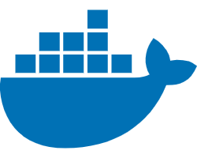

## 前端工程师—bowen

热爱编程、热爱技术。

### **社交主页：**

 

-   <a href="https://bowen99991.github.io/bowenBlog/"><code>:smiley::smiley::smiley:</code></a>：个人博客，发表技术文章, 个人博客。

### **技术栈:**

<a href="https://v3.cn.vuejs.org"><code></code></a>
<a href="https://reactjs.org/"><code></code></a>
<a href="https://nextjs.org/"><code></code></a>
<a href="https://www.tslang.cn/index.html"><code></code></a>
<a href="https://webpack.js.org/"><code></code></a>
<a href="https://cn.vitejs.dev"><code></code></a>
<a href="https://sass-lang.com"><code></code></a>
<a href="https://tailwindcss.com"><code></code></a>
<a href="https://go.dev/"><code></code></a>
<a href="https://www.docker.com"><code></code></a>

### 开源项目

   

### Github 活跃度

